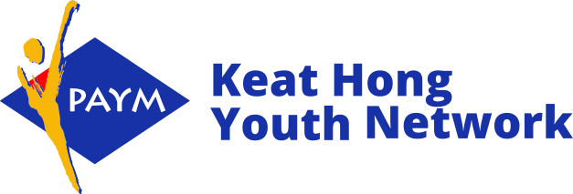

<!-- PROJECT LOGO -->
 

  

> This project is not in production and has been archived.

<h3 align="center">Keat Hong Youth Network Landing Site</h3>
  

    #techforpublicgood
     
     
    <a href="https://github.com/KeatHongYN/khyn-landing/blob/master/SECURITY.md">Report Issues</a>
    ·
    <a href="https://github.com/Ducksss/HacknRoll2023-Robin-Hood/issues">Request Features</a>
  

<!-- TABLE OF CONTENTS -->

## Table of Contents

- [Table of Contents](#table-of-contents)
- [About the Project](#about-the-project)
  - [Built with](#built-with)
- [Contributing](#contributing)
- [Security and Feedback](#security-and-feedback)
- [Contact](#contact)
- [Acknowledgements](#acknowledgements)

## About the Project

The [Keat Hong Youth Network Landing site](https://www.keathongyouths.sg) is a website that is currently in development. The goal of the project is to revamp an existing WordPress site with poor user experience and add new features, such as the ability to view events. The site is not currently hosted, but once it is completed it will be available to the public.

### Built with

-   [Next JS](https://nextjs.org/)
-   [TypeScript](https://www.typescriptlang.org/)
-   [React 18](https://reactjs.org/)
-   [SASS](https://sass-lang.com/)
-   [Netlify](https://www.netlify.com/)
-   [Sentry](https://sentry.io/)
-   [Firebase](https://firebase.google.com/)
-   [Figma](https://www.figma.com/)

## Contributing

We welcome contributions and pull requests. Please read our [contributor guidelines](https://github.com/KeatHongYN/khyn-landing/blob/master/CONTRIBUTING.md).

## Security and Feedback

Please read [SECURITY.md](https://github.com/KeatHongYN/khyn-landing/blob/master/SECURITY.md) for more info.

## Contact

-   Tham Kei Lok (Fullstack Engineer/UIUX Designer) - [LinkedIn](https://www.linkedin.com/in/thamkeilok/)

## Acknowledgements

Thanks to **[Wei Pin](https://www.linkedin.com/in/wei-pin-teo-317374176/)** for compiling the images and helping out with the administrative work, and to **[Pin Zheng](https://www.linkedin.com/in/chai-pin-zheng-5610921aa/)** and **You Cheng** for lending their valuable input and expertise leading up to the initial release, and to **[Estrella](https://www.linkedin.com/in/estrella-kwok/)** and **Jamie** for providing their testimonials.

(<a href="#top">back to top</a>)

